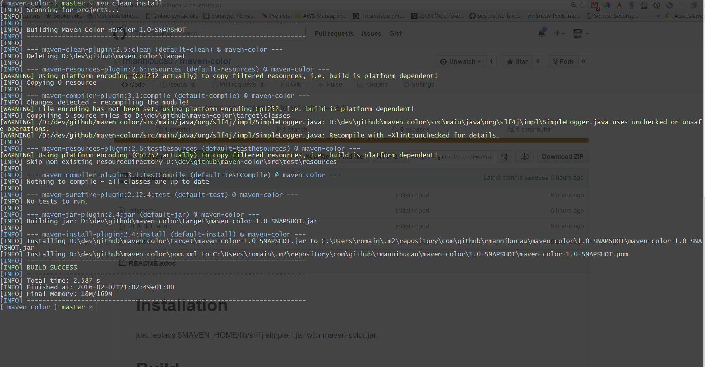

= Installation

just replace $MAVEN_HOME/lib/slf4j-simple-*.jar with maven-color.jar. and add jansi-1.11.jar in the same folder.

= Build

[source]
----
mvn clean install
----

= Configuration

Handled colors are configurable, here are the defaults (key and values):

|===
| Key | Value
| org.slf4j.simpleLogger.color.TRACE | GREEN
| org.slf4j.simpleLogger.color.DEBUG | GREEN
| org.slf4j.simpleLogger.color.ERROR | RED
| org.slf4j.simpleLogger.color.WARN | YELLOW
| org.slf4j.simpleLogger.color.INFO | DEFAULT
| org.slf4j.simpleLogger.color.INFO | DEFAULT
| org.slf4j.simpleLogger.color.default | DEFAULT
| org.slf4j.simpleLogger.color.build.success | GREEN
| org.slf4j.simpleLogger.color.build.failed | RED
| org.slf4j.simpleLogger.color.plugin | BLUE
| org.slf4j.simpleLogger.color.separator | BLUE
|===

You need to edit ${maven.home}/conf/logging/simplelogger.properties file.

= Skip colors

For batch executions or when redirecting output, you can disable colors by setting property `maven.colors.skip` to true
----
MAVEN_OPTS="$MAVEN_OPTS -Dmaven.colors.skip=true" mvn compile
----

= Sample

= Experimental

The produced jar by maven build is executable and can setup maven:

[source]
----
export MAVEN_HOME=...
java -jar maven-color.jar
----

or

[source]
----
java -jar maven-color.jar /path/to/maven/home
----
